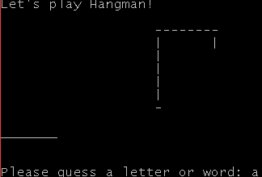
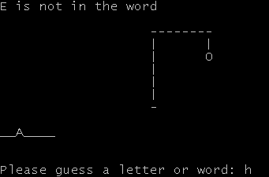
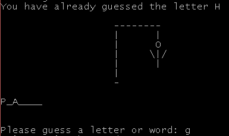
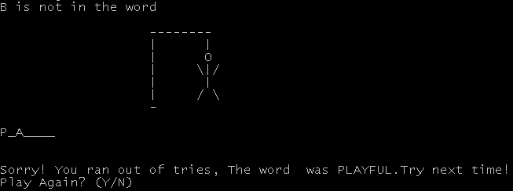

# Hangman
Simple Hangman Game in Python
This is simple hangman game implemented in python.
it has text file including all the words.
please make sure to keep all the files in one directory or else it will not work.
This game selects any random word from the file and asks you to guess character for that word.
You will get 8 chances to guess a word.
when you guesses correct character your chance will not be counted when you gives wrong character your chance will be reduced by one.

Hope you enjoy this game. 
Any modification in this game would be highly appreciated.

## How to play
To start a new game , run:
```sh
python hangman.py
```

And the fun starts! Let's start with letter 'a'



Let's start with letter 'a'


How lucky we are! Now we enter 'e':



Oops! Looks like we have run out of luck this time!
And also you can't have duplicate predictions!



The game goes on until you fully guess the word or run out of tries:



You can play again by entering Y or end the game by entering N
